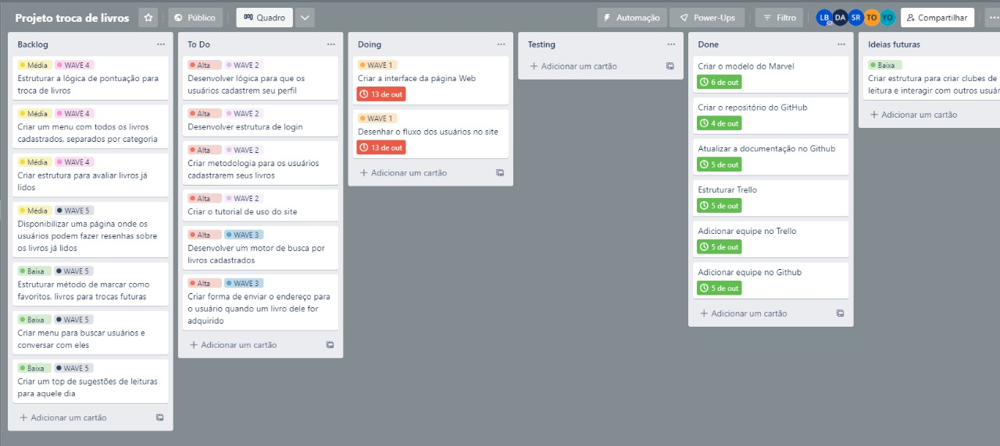

# Metodologia

Pré-requisitos: <a href="02-Especificação do Projeto.md"> Documentação de Especificação</a>

A metodologia contempla as definições das ferramentas utilizadas pela equipe tanto para a manutenção dos códigos e demais artefatos quanto para a organização do time na execução das tarefas do projeto. 

## Relação de Ambiente de Trabalho

Os artefatos do projeto são desenvolvidos a partir de diversas plataformas e a relação dos ambientes com seu respectivo propósito é apresentada na tabela que se segue. 

|Ambiente|Plataforma|Link de Acesso|
|--------|----------|--------------|
|Repositório de Código Fonte|GitHub|https://github.com/ICEI-PUC-Minas-PMV-ADS/pmv-ads-2022-2-e1-proj-web-t10-projeto_troca_livros_ads_turma_10|
|Documentos do Projeto|GitHub|https://github.com/ICEI-PUC-Minas-PMV-ADS/pmv-ads-2022-2-e1-proj-web-t10-projeto_troca_livros_ads_turma_10|
|Projeto de Interface e Wireframes|MarvelApp|https://marvelapp.com/prototype/663298f/screen/89003175/handoff|
|Gerenciamento do Projeto|Trello|https://trello.com/b/VAabS2Lw/projeto-troca-de-livros|
|Comunicação e Reuniões|Microsoft Teams|https://teams.microsoft.com/l/channel/19%3a8g-0FD60ijce0urmOIhP6xL_Zil7AmWpVnVnbZyxMzg1%40thread.tacv2/Geral?groupId=be7e1401-60a2-4632-b3f4-ef52c0302753&tenantId=14cbd5a7-ec94-46ba-b314-cc0fc972a161|
|Formulário de Mapeamento das Personas|Google Forms|https://docs.google.com/forms/d/e/1FAIpQLSe4pFSdFbmRw_rX4HHp-8y7UCEsK1-4XFBbquZe_f0VMCk-mg/viewform?pli=1|

## Controle de Versão

A ferramenta de controle de versão adotada no projeto foi o
[Git](https://git-scm.com/), sendo que o [Github](https://github.com)
foi utilizado para hospedagem do repositório.

O projeto segue a seguinte convenção para o nome de branches:

- `main`: versão estável já testada do software
- `unstable`: versão já testada do software, porém instável
- `testing`: versão em testes do software
- `dev`: versão de desenvolvimento do software

Quanto à gerência de issues, o projeto adota a seguinte convenção para
etiquetas:

- `documentation`: melhorias ou acréscimos à documentação
- `bug`: uma funcionalidade encontra-se com problemas
- `enhancement`: uma funcionalidade precisa ser melhorada
- `feature`: uma nova funcionalidade precisa ser introduzida

## Gerenciamento de Projeto

### Divisão de Papéis

A equipe está organizada da seguinte forma: 

  * **Scrum Master:** Lucas Batista 
  * **Product Owner:** Yuri Oliveira 

Equipe de Desenvolvimento: 

  * Thaís Oliveira 
  * Samuel Ribeiro 
  * Roander Trindade 
  
Equipe de Design: 

  * Daphine Almeida 

Para organização e distribuição das tarefas do projeto, a equipe está utilizando o Trello  estruturado com as seguintes listas:  
  * ***Backlog:*** recebe as tarefas a serem trabalhadas e representa o Product Backlog. Todas as atividades identificadas no decorrer do projeto serão avaliadas e caso não sejam fundamentais, irão incorporar essa etapa. 
  * ***To Do:*** Esta lista representa o Sprint Backlog. Este é o conjunto de atividades a serem desenvolvidas no curtíssimo prazo, mas que ainda não foram iniciadas. 
  * ***Doing:*** Estas são as atividades que de fato estão em fase de desenvolvimento. Estas são as atividades que já estão no momento mão na massa. 
  * ***Testing:*** Todo o desenvolvimento após ser concluído, é transferido para a seção de testes, aqui as funcionalidade serão testadas e se aprovadas, irão para produção. 
  * ***Done:*** nesta etapa, está a conclusão da atividade, o produto sobe para produção e fica disponível para utilização dos usuários em geral 

O quadro kanban de acompanhamento das atividades pelo Trello está disponível através da URL https://trello.com/b/VAabS2Lw/projeto-troca-de-livros e é apresentado, no estado atual, na Figura abaixo.  

### Tabela das Sprints do Projeto

### Ferramentas

As ferramentas empregadas no projeto são:

- Editor de código: Visual Studio Code.
- Ferramentas de comunicação: Microsoft Teams.
- Ferramentas de desenho de tela (_wireframing_): MarvelApp.

O editor de código foi escolhido porque ele possui uma integração com o
sistema de versão. As ferramentas de comunicação utilizadas possuem
integração semelhante e por isso foram selecionadas. Por fim, para criar
diagramas utilizamos essa ferramenta por melhor captar as
necessidades da nossa solução.

