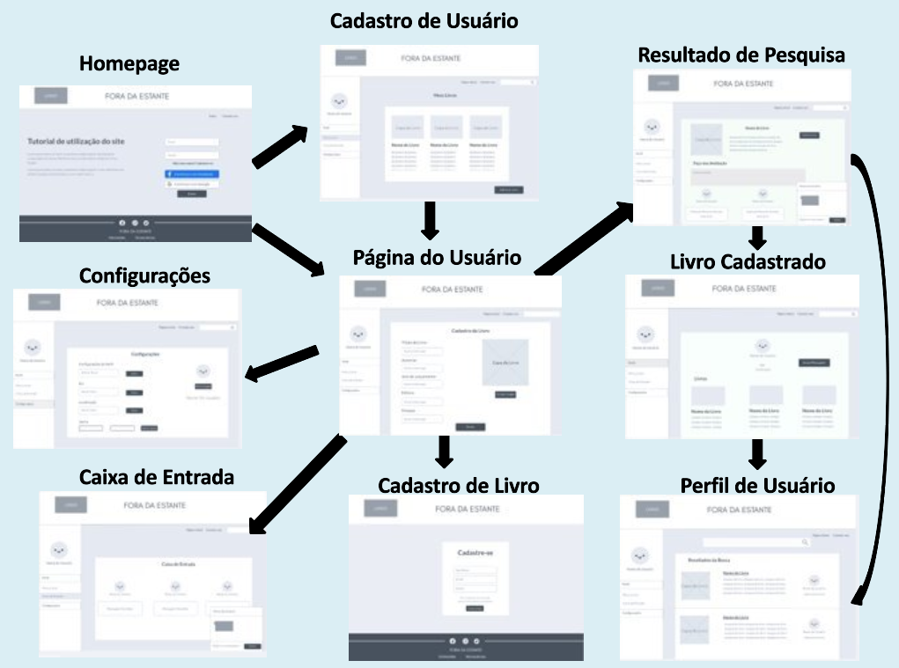

# Projeto de Interface

Pré-requisitos: <a href="02-Especificação do Projeto.md"> Documentação de Especificação</a>

Diante os desafios da estruturação do sistema e buscando alternativas para ser o mais amigável e intuitivo, questões como agilidade, usabilidade e acessibilidade foram priorizadas frente a outras como funcionalidades adicionais da plataforma. Como facilitador, todas as páginas do projeto seguem uma mesma linha de identidade visual para facilitar o contado do usuário do outro lado da tela. 

## Fluxo do Usuário

O diagrama apresentado na figura 1 mostra o fluxo de interação do usuário pelas telas do sistema. Cada uma das telas deste fluxo é detalhada na seção de Wireframes que se segue. Para visualizar o wireframe interativo, acesse o ambiente MarvelApp do projeto. 

Figura 1 - Fluxo de telas do usuário.

## Wireframes

Conforme fluxo de telas do projeto, apresentado no item anterior, as telas do sistema são apresentadas em detalhes nos itens que se seguem. As telas do sistema apresentam uma estrutura comum que é apresentada na figura 2. Nesta estrutura, existem 3 grandes blocos, descritos a seguir. São eles: 

  - Cabeçalho - local onde são dispostos elementos fixos de identidade (logo); 
  - Conteúdo - apresenta o conteúdo da tela em questão; 
  - Barra lateral - apresenta menu de perfil do usuário. 

Figura 2 - Estrutura padrão do site.

### Tela - Homepage 

A tela de homepage (figura 3) apresenta um tutorial de utilização do site com uma opção de login, bem como da possibilidade de cadastro para aqueles que ainda não tem conta. Com base na estrutura padrão, o bloco de Conteúdo traz o tutorial (imagem e textos que ilustram o processo de troca na plataforma e área de login). Por fim, o cabeçalho apresenta o logo da empresa e o rodapé contém links para as diretrizes e políticas do site. 

Figura 3 - Tela Inicial – Homepage.

### Tela – Cadastro de Usuário 

A tela de cadastro do usuário (figura 4) apresentará um formulário a ser preenchido com informações obrigatórias de nome e sobrenome, e-mail, senha, biografia e foto de perfil. O usuário deverá marcar uma caixa de check-box concordando com os termos de uso do site. O rodapé contém links para as diretrizes e políticas do site. 

Figura 4 - Tela de Cadastro de Usuário 

### Tela - Página do Usuário 

A tela de Página do Usuário(figura 5) tem em seu cabeçalho a logo da empresa. Logo abaixo, apresenta no Bloco de Conteúdo as informações de perfil do usuário, seus livros cadastrados, um botão para cadastro de novos livros e o motor de busca. Já a Barra Lateral, apresenta menu do perfil para acesso a caixa de entrada e configurações. 

Figura 5 - Tela da Página do Usuário 

### Tela – Cadastro de Livro 

A tela de Cadastro de Livro (figura 6) apresenta no Bloco de Conteúdo os campos para preenchimento do formulário com as informações relevantes a serem dispostas na página do livro. O cabeçalho apresenta a logo. 

Figura 6 - Tela do Cadastro de Livro 

### Tela - Resultado de Pesquisa 

Assim que o usuário informa o nome do livro no campo de pesquisa, ao dar “enter” ele é direcionado para uma tela que traz a relação de livros cadastrados associadas aos termos informados. Apresenta também, a Barra Lateral com o menu de perfil e cabeçalho com logo. Este resultado é apresentado na Figura a seguir. 

Figura 7 - Tela de Resultados de Pesquisa 

### Tela – Livro cadastrado 

A tela do Livro apresenta, no Bloco de Conteúdo, as informações do livro (imagem, sinopse, estado de conservação, resenha), comentários realizados pelos usuários, botão de solicitação de livro e caixa de mensagem para troca de mensagens com o usuário que cadastrou o livro. Apresenta também, menu de perfil do usuário na barra lateral e cabeçalho com logo.  

Figura 8 - Tela de Livro Cadastrado 

### Tela – Caixa de Entrada 

A tela que permite acessar as mensagens recebidas e permite o contato via chat com outros usuários. Apresenta também, barra lateral com menu de perfil do usuário e cabeçalho com logo. 

Figura 9 – Caixa de Entrada 

### Tela - Configurações 

A tela de Configurações apresenta os dados pessoais do usuário. Nesta tela, o usuário será capaz de alterar dados, trocar imagem de perfil e senha. Apresenta também, barra lateral com menu de perfil do usuário e cabeçalho com logo. 

Figura 10 - Tela de Configurações 

### Tela – Perfil de Usuários 

Na tela em questão, o usuário pode visualizar o perfil de outros usuários do site que constam suas informações (foto de perfil, biografia curta e localização), livros cadastrados e botão para envio de mensagem. Apresenta também, barra lateral com menu de perfil e cabeçalho com logo. 

Figura 11 - Tela de Perfil de Usuários 

 
