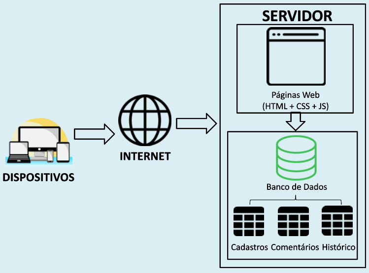

# Arquitetura da Solução

Pré-requisitos: <a href="04-Projeto de Interface.md"> Projeto de Interface</a>

Nesta seção são apresentados os detalhes técnicos da solução criada pela equipe, tratando dos componentes que fazem parte da solução e do ambiente de hospedagem da solução. 

## Diagrama de componentes

O diagrama permite a modelagem física de um sistema, através da visão dos seus componentes e dos relacionamentos entre os mesmos.

Os componentes que fazem parte da solução do presente projeto estão representados na figura 1.

Figura 1 - Arquitetura da Solução 

A solução implementada conta com os seguintes módulos:
- **Navegador** - Interface básica do sistema  
  - **Páginas Web** - Conjunto de arquivos HTML, CSS, JavaScript e imagens que implementam as funcionalidades do sistema.
   - **Armazenamento Remoto** - armazenamento mantido no servidor, onde são implementados bancos de dados baseados em JSON. São eles: 
     - **Cadastros** - registro de dados de usuários e de livros
     - **Comentários** - registro de opiniões dos usuários sobre os livros
     - **Histórico** - lista as trocas feitas entre usuários e acessos posteriores
 - **Hospedagem** - local na Internet onde as páginas são mantidas e acessadas pelo navegador. 

## Tecnologias Utilizadas

- Linguagens utlizadas para desenvolver o projeto: HTML, CSS, JavaScript, PHP, MySql.
- IDEs de desenvolvimento: Visual Studio Code
- Plataforma para hospedagem do site: GitHubPages
- Plataforma para hospedagem dos arquivos: GitHub
- Ferramenta de versionamento: Git
- Ferramenta para a criação de logo e imagens: Canva
- Ferramenta para crição de template: MarvelApp

## Hospedagem

O site utiliza a plataforma do GitHubPages como ambiente de hospedagem do site do projeto. O site é mantido no ambiente da URL:https://pages.github.com/ .

 

