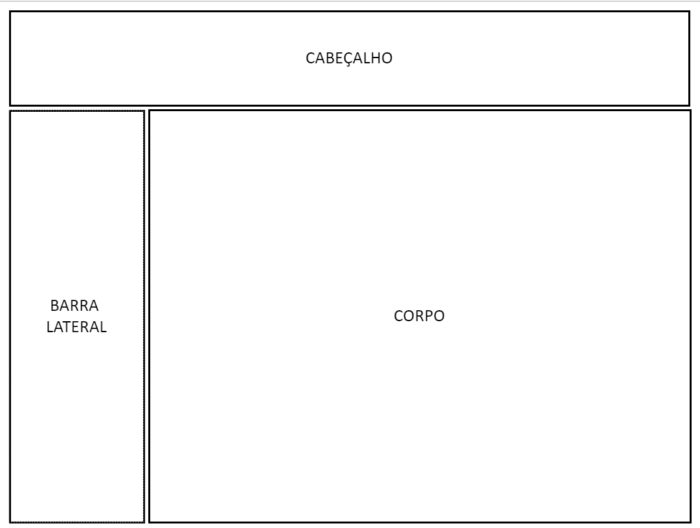
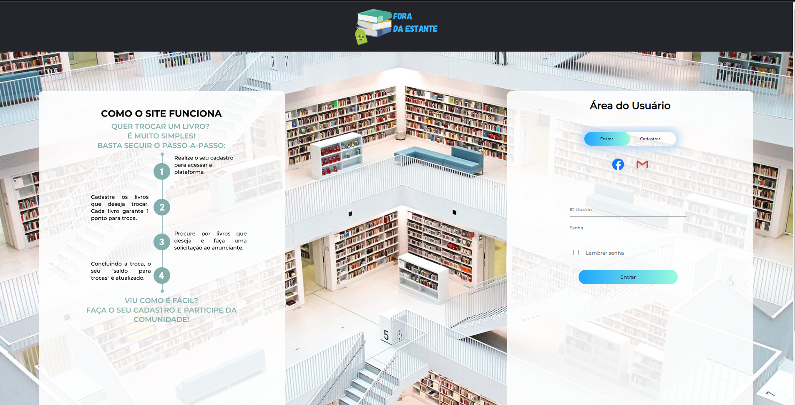
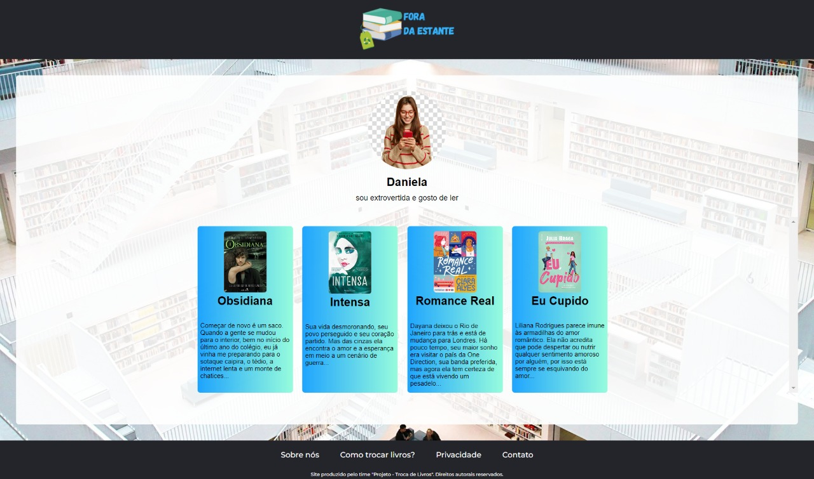
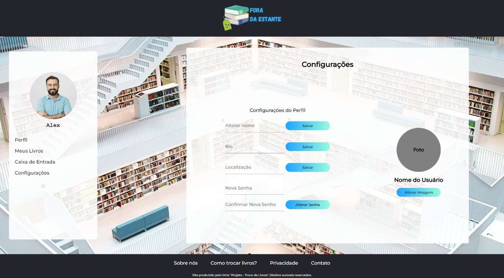
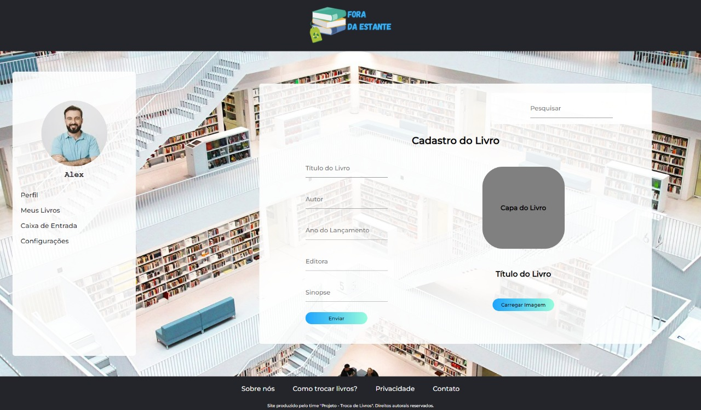

# Template padrão do site

Pré-requisitos: <a href="02-Especificação do Projeto.md"> Especificação do Projeto</a>, <a href="04-Projeto de Interface.md"> Projeto de Interface</a>, <a href="03-Metodologia.md"> Metodologia</a>

O padrão de layout a ser utilizado pelo site tem relação com o projeto de Interface elaborado anteriormente, conforme a Figura 1.

Figura 1 - Estrutura padrão do site.

O template está disponível no seguinte link: https://github.com/ICEI-PUC-Minas-PMV-ADS/pmv-ads-2022-2-e1-proj-web-t10-projeto_troca_livros_ads_turma_10/blob/main/docs/img/template.png  e é composto pelos seguintes layouts: 

1. Tela inicial e de login
2. Tela de cadastro do usuário
3. Tela de perfil do usuário
4. Tela de configurações
5. Tela de página do usuário
6. Tela de caixa de entrada
7. Tela de cadastro do livro
8. Tela de pesquisa de livros
9. Tela do livro cadastrado

A responsividade segue o padrão do Bootstrap.
### 1.Tela Inicial e de Login
Tela que abrange o tutorial de uso do site e guia de login (figura 2).

Figura 2 - Homepage do site.

### 2.Tela de Cadastro do Usuário
Tela que permite aos usuários se cadastrarem para utilizar o site.

### 3.Tela de Perfil do Usuário
Tela que apresenta o perfil cadastrado, uma biografia resumida e os livros de interesse. 

Figura 4 - Perfil do Usuário.

### 4.Tela de Esqueci Minha Senha
Tela que possibilita o usuário o lembrete de senha por e-mail.

Figura 5 - Esqueci Minha Senha.

### 5.Tela de Configurações do Perfil
Tela que possibilita o usuário a configuração do seu perfil.

Figura 6 - Esqueci Minha Senha.

### 6.Tela de Caixa de Entrada
A tela que permite acessar as mensagens recebidas em sua caixa de entrada e o contato com outros usuários por meio de envio de mensagens. 

Figura 7 - Caixa de Entrada.

### 7.Tela de Cadastro do Livro
A tela que permite inserir todos os dados do livro a ser cadastrado, bem como foto da capa. 

Figura 8 - Cadastro de Livro.

### 8.Tela de Como Trocar os seus Livros
A tela apresenta ao usuário um informativo de possibilidades de troca de livros e funcionalidades do site.

Figura 9 - Troca de Livros.

### 9.Política e Privacidade
A tela apresenta a política e privacidade do site.

Figura 10 - Política e Privacidade.

### 10.Tela Sobre nós
A tela apresenta nossos objetivos, quem somos e a proposta da Fora da Estante. 

Figura 11 - Sobre nós.

### 11.Tela Contato
A tela apresenta ao usuário os meios de contato com a Fora da Estante.

Figura 11 - Contato.

