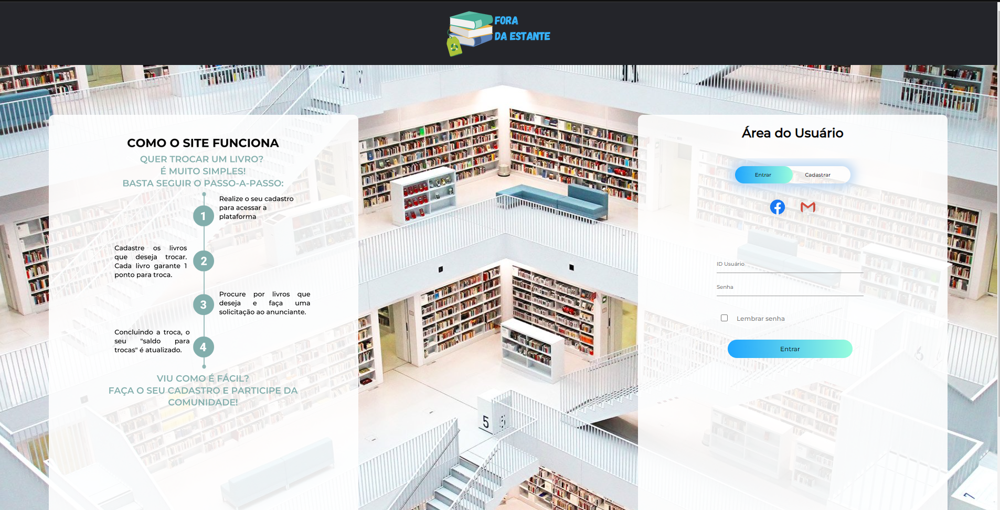
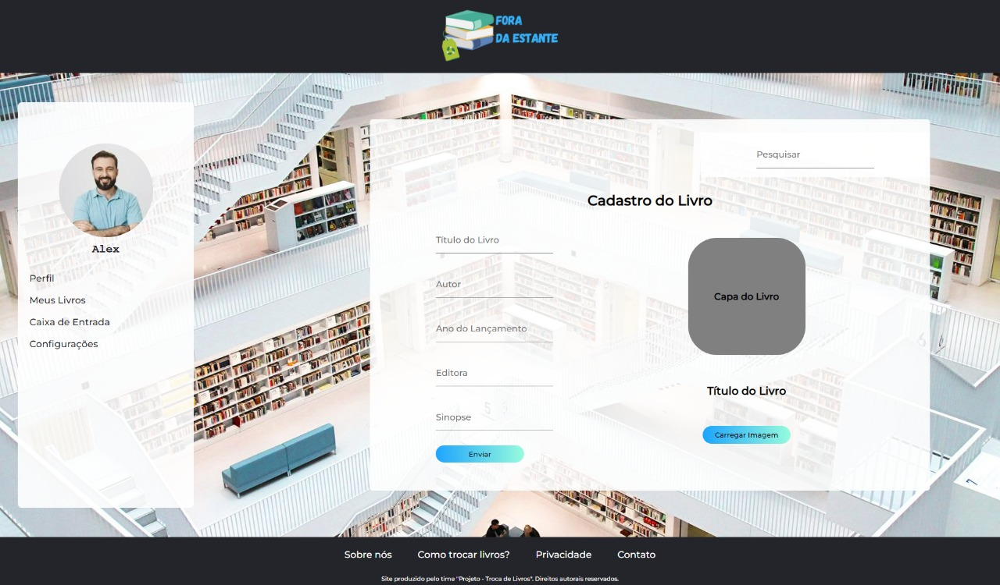
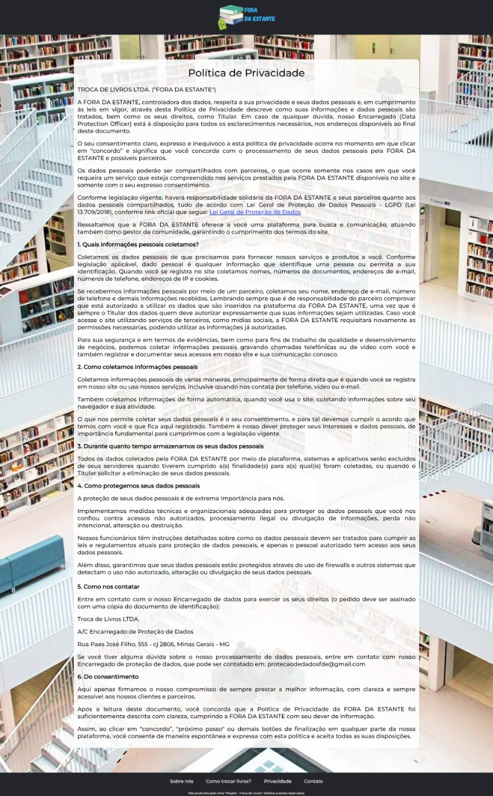

# Funcionalidades do Sistema

Pré-requisitos: <a href="02-Especificação do Projeto.md"> Especificação do Projeto</a>, <a href="3-Projeto de Interface.md"> Projeto de Interface</a>, <a href="03-Metodologia.md"> Metodologia</a>, <a href="05-Arquitetura da Solução.md"> Arquitetura da Solução</a>

Nesta seção são apresentadas as telas desenvolvidas para cada uma das funcionalidades do sistema com a atribuição dos requisitos atendidos.

## 1.	Tela Inicial e de Login (RF-003)
A tela principal do sistema (figura 1) é bem intuitiva, permitindo ao usuário realizar o login na plataforma, além de apresentar um tutorial de uso do sistema de trocas de livros.
Isso tornará o usuário mais familiarizado com a nossa solução.

Figura 1 - Homepage do site.

### Requisitos atendidos
**RF-003** - O site deve apresentar na página principal um tutorial de utilização do site e área de cadastro/login.

### Artefatos da funcionalidade
-	homapage.html
-	fb.png
-	style.css
-	foradaestante1.png
-	gmail.png
- livraria.jpeg
- passos.png

### Estrutura de Dados

[em desenvolvimento]

### Intruções de Acesso
1.	Abra o navegador de Internet e informe a seguinte URL: [PEGAR A URL]
2.	A seção de login é a primeira funcionalidade a ser exibida na tela.

## 2.Tela de Perfil do Usuário (RF-001)
Tela que apresenta o perfil cadastrado, uma biografia resumida e os livros de interesse.

Figura 2 - Perfil do Usuário.

### Requisitos atendidos
**RF-001** - O site deve permitir que os usuários criem o seu perfil na página e acesso página de perfil. 

### Artefatos da funcionalidade
-	perfil.html
-	fb.png
-	style.css
-	foradaestante1.png
-	gmail.png
- livraria.jpeg
- passos.png

### Estrutura de Dados

### 3.Tela de Esqueci Minha Senha
Tela que possibilita o usuário o lembrete de senha por e-mail.

Figura 3 - Esqueci Minha Senha.

### Requisitos atendidos
**RF-003** - O site deve apresentar na página principal tutorial de utilização do site e área de cadastro/login e esqueci minha senha. 

### Artefatos da funcionalidade
-	esquecisenha.html
-	fb.png
-	style.css
-	foradaestante1.png
-	gmail.png
- livraria.jpeg
- passos.png

### Estrutura de Dados

### 4.Tela de Configurações do Perfil
Tela que possibilita o usuário a configuração do seu perfil.

Figura 4 - Configurações do Perfil

### Requisitos atendidos
**RF-001** - O site deve permitir que os usuários criem o seu perfil na página e acesso página de perfil. 

### Artefatos da funcionalidade
-	configperfil.html
-	fb.png
-	style.css
-	foradaestante1.png
-	gmail.png
- livraria.jpeg
- passos.png

### Estrutura de Dados

### 5.Tela de Caixa de Entrada
A tela que permite acessar as mensagens recebidas em sua caixa de entrada e o contato com outros usuários por meio de envio de mensagens. 

Figura 5 - Caixa de Entrada.

### Requisitos atendidos
**RF-008** - O site deve permitir a busca por usuário cadastrado e caixa de entrada para troca de mensagens. 

### Artefatos da funcionalidade
-	homapage.html
-	fb.png
-	style.css
-	foradaestante1.png
-	gmail.png
- livraria.jpeg
- passos.png

### Estrutura de Dados

### 6.Tela de Cadastro do Livro
A tela que permite inserir todos os dados do livro a ser cadastrado, bem como foto da capa. 

Figura 6 - Cadastro do Livro.

### Requisitos atendidos
**RF-004** - O site deve oferecer um menu com todos os livros cadastrados, separados por categoria. 

### Artefatos da funcionalidade
-	homapage.html
-	fb.png
-	style.css
-	foradaestante1.png
-	gmail.png
- livraria.jpeg
- passos.png

### Estrutura de Dados

### 7.Tela de Como Trocar os seus Livros
A tela apresenta ao usuário um informativo de possibilidades de troca de livros e funcionalidades do site.

Figura 7 - Troca de Livros.

### Requisitos atendidos
**RF-003** - O site deve apresentar na página principal tutorial de utilização do site e área de cadastro/login e esqueci minha senha

### Artefatos da funcionalidade
-	homapage.html
-	fb.png
-	style.css
-	foradaestante1.png
-	gmail.png
- livraria.jpeg
- passos.png

### Estrutura de Dados

### 8.Tela da Política e Privacidade
A tela apresenta a política e privacidade do site.

Figura 8 - Política e Privacidade.

### Requisitos atendidos
**RF-007** - O site deve permitir marcar como favoritos, item sobre nós, formas de contato e política de privacidade. 

### Artefatos da funcionalidade
-	homapage.html
-	fb.png
-	style.css
-	foradaestante1.png
-	gmail.png
- livraria.jpeg
- passos.png

### Estrutura de Dados

### 9.Tela de Sobre nós
A tela apresenta nossos objetivos, quem somos e a proposta da Fora da Estante. 

Figura 9 - Sobre nós.

### Requisitos atendidos
O site deve permitir marcar como favoritos, item sobre nós, formas de contato e política de privacidade.  

### Artefatos da funcionalidade
-	homapage.html
-	fb.png
-	style.css
-	foradaestante1.png
-	gmail.png
- livraria.jpeg
- passos.png

### Estrutura de Dados

### 10.Tela de Formas de Contato
A tela apresenta ao usuário os meios de contato com a Fora da Estante.

Figura 10 - Formas de Contato.

### Requisitos atendidos
**RF-007** - O site deve permitir marcar como favoritos, item sobre nós, formas de contato e política de privacidade. 

### Artefatos da funcionalidade
-	homapage.html
-	fb.png
-	style.css
-	foradaestante1.png
-	gmail.png
- livraria.jpeg
- passos.png

### Estrutura de Dados

### Artefatos da funcionalidade
- pesquisa.html
- script_pesquisa.js
- style.css
- icone_lupa.jpg

### Intruções de Acesso 
3.	Faça o download do arquivo do projeto (ZIP) ou clone do projeto no GitHub;
4.	Descompacte o arquivo em uma pasta específica;
5.	Abra o Visual Studio Code e execute o Live Server;
6.	Abra um navegador de Internet e informe a seguinte URL: http://127.0.0.1:5500/homepage.html 

